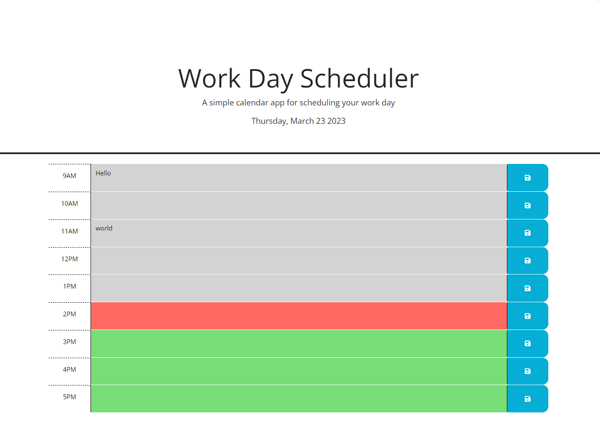

# Calendar

GitHub: https://efp18.github.io/Calendar/

In this assignment, I created a calendar using Jquery, HTML and CSS with the help of bootstrap. 
I combined it with Dayjs() in order to get the current time, and compare the business hours of the schedule
to inform the user of his past, present, and future tasks. In each case, the color of the corresponding time/row changes, and portrays those classes (past, present, future).

Also, with the help of local storage, the user can type in a task, save it, and the next time he will use the website it will bring up the tasks he originally typed in. 

Lastly, I used Dayjs() to add the current date at the top of the page, and also to get the current time to compare later on. 